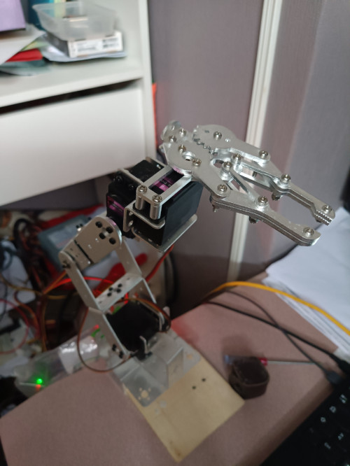

# Armbot

A library to control a robotic arm with ESP32



## Exemple

```python
from dev import Arm

arm = Arm()
motion = arm.motion
base = arm.motor['base']
shoulder = arm.motor['shoulder']
elbow = arm.motor['elbow']
wrist = arm.motor['wrist']
clamp = arm.motor['clamp']


# Add motions to list
motion.append(wrist.goTo(6000))
motion.append(wrist.goToMin())
motion.append(clamp.goToMin())
motion.append(clamp.goToMax())

# Execute all motions
motion.go()
```